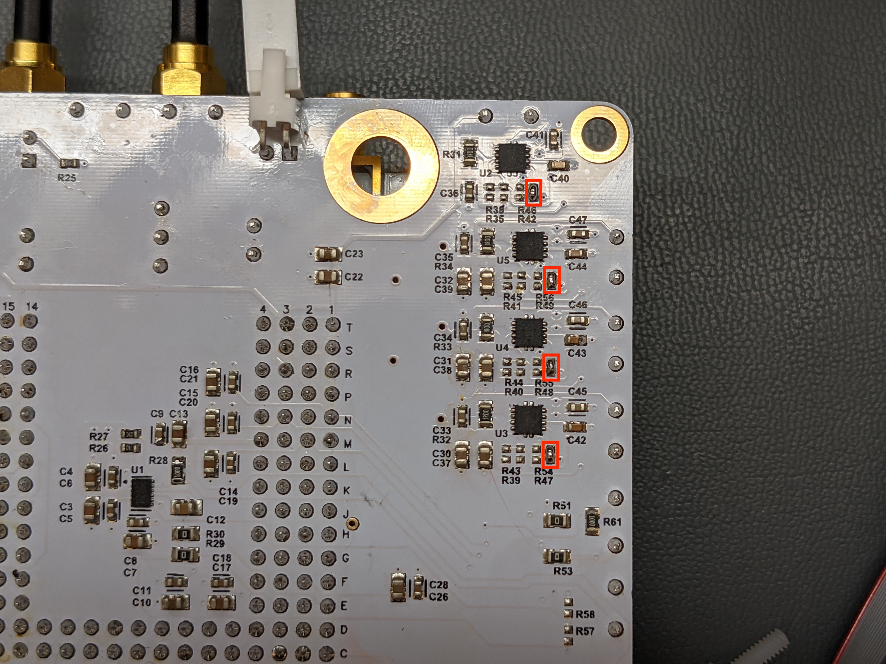
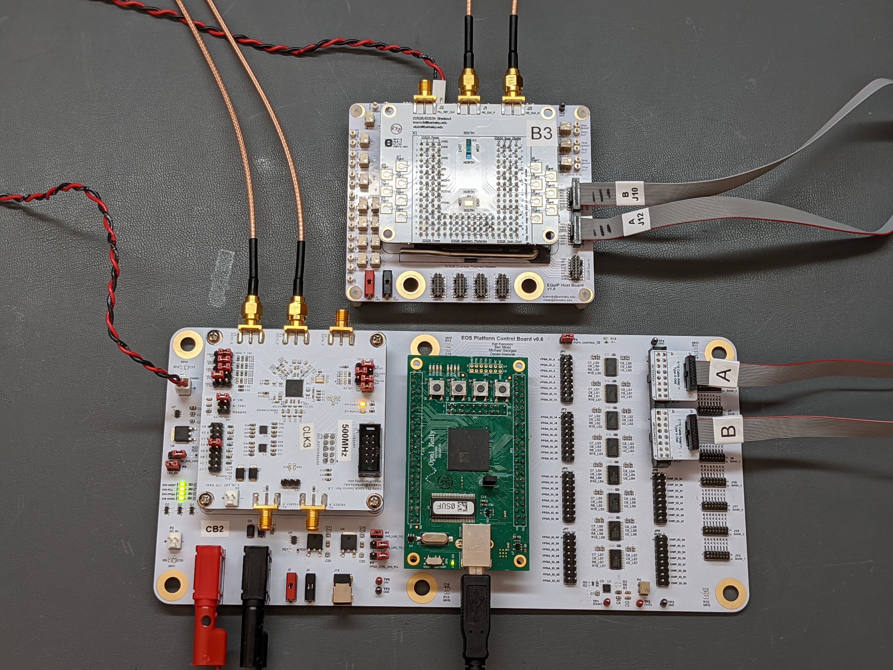

<h1>EOS26/EOS34 Host Board Instructions:</h1>

Follow these instructions in order. In order to prevent damage to the chips, you must make sure the voltages are set prior to installing a chip board.

<h2>Required Rework</h2>

[1] Short the highlighted pullups (rightmost unpopulated resistors under the LDOs when looking from the bottom) to enable all of the positive LDOs:

[2] Short the highlighted pullup (R22) so that the CML2CMOS IBIAS potentiometer adjusts the voltage between 0V and VDD instead of only being able to pull down:

<h2>Adjustments Before Installing Chip Board</h2>

[1] Solder a 90-degree 0.1" Molex connector with locking tab in position P1. Note that this connector should be installed upside-down to provide good clearance to the SMA connectors on the chip board and match the polarity of the FPGA control board:

[2] Install a power cable between host board and control board and power the control board so that 5V is delivered to the host board. Alternatively, a 5V external power supply may be used (Note: J1 and J2 are connected in parallel with P1, allowing pin-type test leads to be used instead of a Molex connector):

[3] Probe between TP17 ("HVDD") and TP29 ("GND"). Adjust potentiometer R8 (nearest one to the HVDD test point) to set the desired heater voltage. 1.35V is the maximum safe voltage for EOS34 source ring heaters. 1.90V is the maximum tested voltage for EOS34 filter ring heaters. Note that heater currents will also depend on VDD since this rail drives the gates of the low-side choppers.

[4] Probe between TP14 ("DVDD") and TP29 ("GND"). Adjust potentiometer R7 (nearest one to the DVDD test point) to set DVDD to 1.80V.

[5] Probe between TP12 ("VDD") and TP29 ("GND"). Adjust potentiometer R6 (nearest one to VDD test point) to set VDD to 1.00V (VDD can range from 0.90V to 1.20V, higher VDD leads to higher heater currents).

[6] Probe between TP10 ("AVDD") and TP29 ("GND"). Adjust potentiometer R5 (nearest one to AVDD test point) to set AVDD to 1.20V.

[7] Probe between TP5 ("VPD") and TP29 ("GND"). Adjust potentiometer R2 (also labeled "VPD") to set VPD to the desired cathode voltage on the photodetector rings (2.40V is a good choice). Higher voltage leads to greater responsivity, but increased dark current.

[8] Probe between TP20 ("VREF0") and TP29 ("GND"). Adjust potentiometer R12 (also labeled "VREF0") to set VREF0 to 0.30V. This sets an internal voltage reference in the source ring tuning controller ADC.

[9] Probe between TP21 ("VREF1") and TP29 ("GND"). Adjust potentiometer R11 (also labeled "VREF1") to set VREF1 to 0.60V. This sets an internal voltage reference in the source ring tuning controller ADC.

[10] Probe between TP25 ("VREF2") and TP29 ("GND"). Adjust potentiometer R10 (also labeled "VREF2") to set VREF2 to 0.90V. This sets an internal voltage reference in the source ring tuning controller ADC.

[11] Install jumpers onto the top positions of J5 ("HVDD"), J4 ("VDD"), and J3 ("AVDD/OVDD"). This routes power to EOS34 circuits (as opposed to EOS26):

<h2>Adjustments After Installing Chip Board</h2>

Note: It is advised to power down the host board when installing a chip board. Press the chip board into the PGA socket by pushing on the 3D-printed cover rather than the pins.

[1] Install the chip board in the PGA socket and make the following connections:
- SMA cables from X3 ("OUT2_P") and X5 ("OUT2_N") on the PLL board to J1 ("HS_CLK_P") and J3 ("HS_CLK_N") on the chip board. It doesn't matter which way you connect the cables, the clock phase will just shift by 180 degrees.
- 16-pin 2x8 0.05" (1.27mm) cable from JP2 ("BANK A") on the FPGA control board to J12 on the chip board, via "EOS Cable Adapter Type G Odd" adapter board.
- 16-pin 2x8 0.05" (1.27mm) cable from JP4 ("BANK B") on the FPGA control board to J10 on the chip board, via "EOS Cable Adapter Type G Odd" adapter board.

Digikey P/N for the cables is: SAM8783-ND (MPN FFSD-08-D-24.00-01-N).

[2] Probe between TP9 ("IREF") and TP8 ("SHNT"). Adjust potentiometer R4 (labeled "IREF") to set the voltage across the IREF shunt to 1.00mV. Use a high-accuracy multimeter to make this adjustment. The shunt resistor has a value of 100 Ohms, so this corresponds to an IREF current of 10uA.

[3] Probe between TP35 ("SHUNT") and TP30 ("OUT"). Adjust potentiometer R13 (labeled "CML2CMOS IBIAS") to set the voltage across the CML2CMOS IBIAS shunt to 50mV. Note: this bias current decreases (to around 30mV) when the CML2CMOS clock receiver is enabled (via scan chain). If scan chain tests work but the heater and ADC self-tests do not work, then investigate this bias current and make sure it decreases when you think you are enabling the CML2CMOS clock receiver. Also try increasing the bias current if it was set lower.

[4] Probe between TP32 ("SHUNT") and TP31 ("OUT"). Turn potentiometer R14 (labeled "IBIAS RX1") all the way counterclockwise to set the RX1 bias current to zero and disable it. This is part of the cryo receiver test site. The potentiometer does not have a hard stop, so adjust until you see a few mV on the multimeter or less and hear a faint clicking sound.

[5] Probe between TP34 ("SHUNT") and TP33 ("OUT). Turn potentiometer R15 (labeled "IBIAS RX2") all the way counterclockwise to set the RX2 bias current to zero and disable it. This is part of the cryo receiver test site. The potentiometer does not have a hard stop, so adjust until you see a few mV on the multimeter or less and hear a faint clicking sound.

<h2>Final Checkout</h2>

The host board is now ready for use. 

Source the sourceme and cd to the following directory:

[experimental_dir]/chips/eos34_dk/

In homebrew ipython, run the following scripts:

experiments/bringup/scan_chain_test.py 
experiments/bringup/equip_bringup_tuning_afe.py

The scan chain test should display a PASS result for all 3 scan chains:

-------- Summary of the scan test -------- 
TX:  SCAN PASSES 
RX:  SCAN PASSES 
EQuIP:  SCAN PASSES

The tuning AFE bringup script should display downward-sloping ADC calibration curves. Here is an example of what the correct output looks like:

If the scan chain test passes, but the ADC test returns constant values for all IDAC settings, this indicates a bad connection related to clocking. Here is an example of what a bad output looks like:

If issues are encountered but all of the bias settings above are correct, reseating the chip board in the PGA socket sometimes resolves the problem.

Sit back, relax, and enjoy your new EOS34 host board!