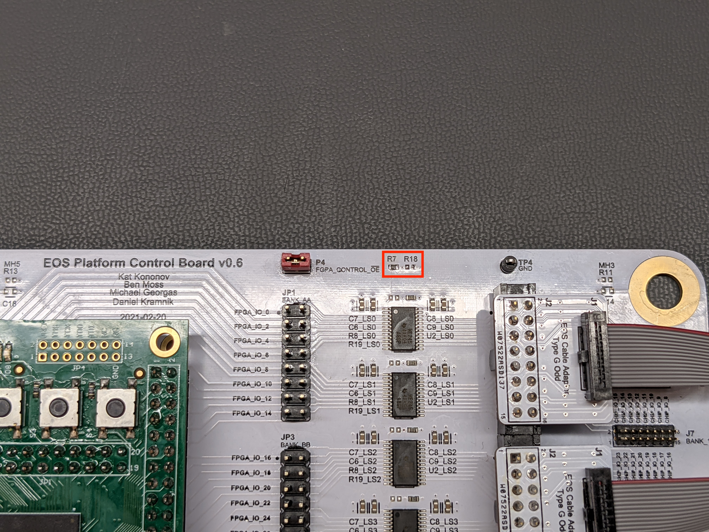
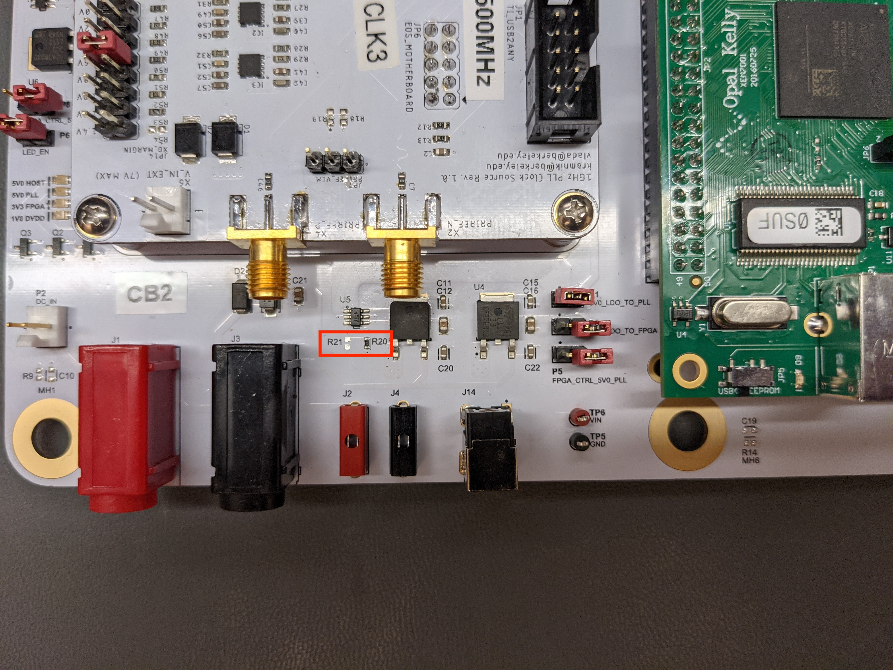
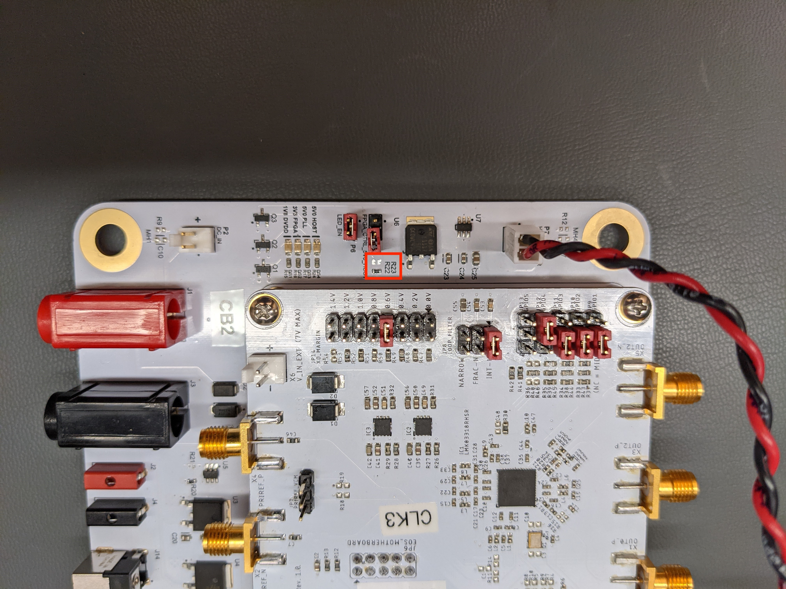
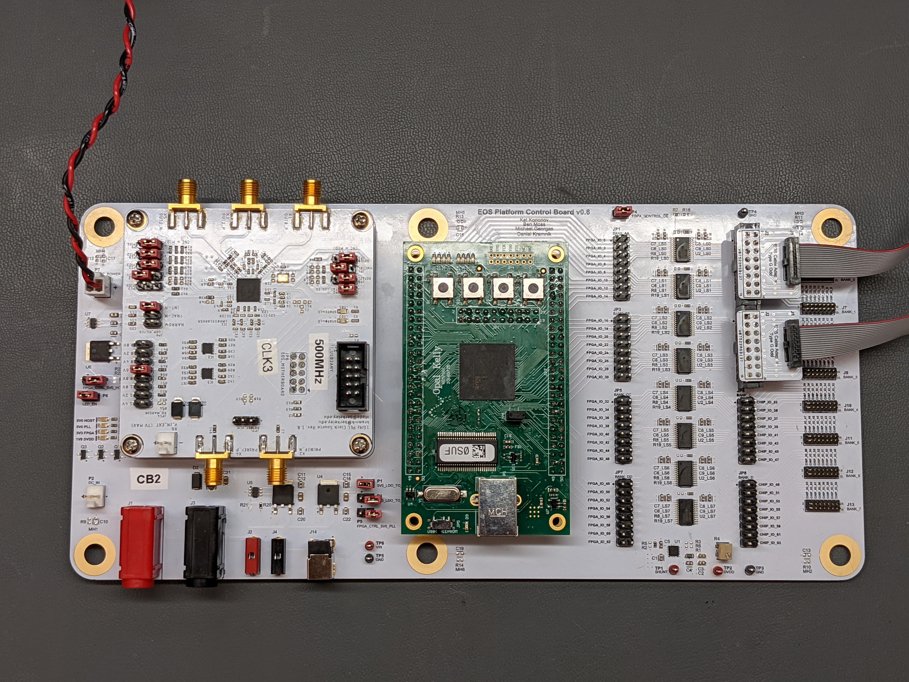

<h1>ISG FPGA Control Board Instructions (XEM7001-A15):</h1>

When the FPGA is powered but the bitfile is not loaded, FPGA pins are low with weak pulldowns. The desired behavior in this state is: host board powered ON, PLL power ON, level shifter output enable de-asserrted (!OE signal high). This requires some rework:

Move R18 (100k pulldown) to R7 (pullup to PP_3V3_IO_FPGA):

Move R21 (330R pulldown) to R20 (pullup to PP_3V3_IO_FPGA):

Move R23 (330R pulldown) to R22 (pullup to PP_3V3_IO_FPGA):

After rework, install the following jumper configuration:

P1: 5V0_LDO_TO_PLL short circuit.
P4: FPGA_CONTROL_!OE short circuit.

P3: 3V3_LDO_TO_FPGA open circuit.
P5: FGPA_CTRL_5V0_PLL open circuit.
P8: FPGA_CTRL_5V0_HOST open circuit.

Ensure that the Opal Kelly board's 3.3V LDO is powering the FPGA by shorting JP3 on the XEM7001 board. This is the default configuration, and there is only one jumper on the Opal Kelly board.

Optional:

P6: LED_EN short circuit.

Explanation:

When the FPGA is plugged in to a computer, the OK board's LDO drives the PP_P3V3_IO_FPGA power rail high. This pulls up the enable signals on the PLL and host board load switches, allowing through power rails generated from the external power supply via LDOs U3 and U6 on the control board. The FPGA IO signals do not control power to the host board or PLL, so you can test/debug these circuits without needed to run a test script that load a bitfile onto the FPGA.

DVDD IO Voltage Adjustment:

With the FPGA plugged in to a USB port and the power supplies powered, adjust potentiometer R4 until you obtain 1.8V (or other desired DVDD voltage) across TP2 ("DVDD") and TP3 ("GND").

<h1>ISG FPGA Control Board Instructions (XEM3001v2, Legacy):</h1>

Not fully brought up yet, but the board does work with XEM3001v2 without any changes to the bitfile. Some rework to the pull resistors is required.

<h1>Desired Features in Next Revision:</h1>

DC power jack is connected pin-negative by accident. Change to pin-positive and add a full-wave recitifer to the DC inputs to the board in order to protect against user error.

OVP should be handled by a special-purpose protection IC instead of TVS. Right now accidentally applying too much voltage causes the TVS to short out. It does protect the board, but it's annoying to fix. Reverse polarity protection could likely also be handled by this IC (do a part search).

Add a pullup to the FPGA_CONTROL_!OE line so that we don't have to rely on pulls being a certain way in the FPGA and rework R7/R18.

Substantiually increase heatsinking of LDOs and/or implement switching power supplies instead. Powering FPGA from LDOs is unrealistic with the present design.

